# RunAndRead Android | [[iOS Version]](https://github.com/answersolutionsapps/runandread-ios) | [[Audiobook Pipeline]](https://github.com/sergenes/runandread-audiobook)

[](https://opensource.org/licenses/MIT)
[](https://www.android.com/)
[](https://kotlinlang.org/)
[](https://play.google.com/store/apps/details?id=com.answersolutions.runandread)

Ultimate Text-to-Speech and Audiobook Player for Android - Listen to your books while running, exercising, or on the go!


## Overview

RunAndRead is an Android application that converts text to speech, allowing you to listen to your books while running, exercising, or on the go. It supports various e-book formats and provides a clean, intuitive interface for managing your library and controlling playback.

## Features

- **Text-to-Speech Playback**: Convert any text or e-book to speech
- **Multiple Voice Support**: Choose from various TTS voices
- **Bookmarks**: Save and jump to specific positions in your books
- **Speed Control**: Adjust playback speed to your preference
- **Library Management**: Organize your books in a clean, intuitive interface
- **E-book Format Support**: Read EPUB, PDF, plain text files, and custom `.randr` archives
- **Background Playback**: Continue listening even when the app is in the background
- **Media Controls**: Control playback from your lock screen or notification
- **Highlighting**: Follow along with highlighted text as it's being read
- **MP3 Audiobook Support**: Listen to high-quality audiobooks generated using the RANDR pipeline


**Download and use the app for free!**

## Installation

### From App Store
🍏 **App Store**: [RunAndRead for iOS](https://apps.apple.com/us/app/run-read-listen-on-the-go/id6741396289)
### From Google Play
🤖 **Google Play**: [RunAndRead for Android](https://play.google.com/store/apps/details?id=com.answersolutions.runandread)


📱 **Scan QR Codes to Download:**

<div align="center">
 &nbsp;&nbsp;&nbsp; 
</div>

### From Source

1. Clone the repository:
   ```
   git clone https://github.com/answersolutions/runandread-android.git
   ```

2. Open the project in Android Studio

3. Build and run the app on your device or emulator

---

## Architecture

RunAndRead follows the MVVM (Model-View-ViewModel) architecture pattern and is built with modern Android development tools and libraries.

### High-Level Architecture

```mermaid
graph TB
    subgraph "📱 UI Layer"
        UI[Jetpack Compose UI]
        VM[ViewModels]
    end

    subgraph "🏗️ Domain Layer"
        PUC[PlayerUseCase]
        BUC[BookmarkUseCase]
    end

    subgraph "🎵 Player Layer"
        BP[BookPlayer Interface]
        ABP[AudioBookPlayer]
        SBP[SpeechBookPlayer]
    end

    subgraph "🗣️ TTS Layer"
        TTS[Text-to-Speech Engine]
    end

    subgraph "💾 Data Layer"
        PSR[PlayerStateRepository]
        REPO[Other Repositories]
        DS[Data Sources]
    end

    subgraph "⚙️ Service Layer"
        PS[Background Services]
    end

    UI --> VM
    VM --> PUC
    VM --> BUC
    VM --> PSR
    PS --> PUC
    PS --> BUC
    PS --> PSR
    PUC --> BP
    BUC --> BP
    PUC --> PSR
    BUC --> PSR
    BP --> ABP
    BP --> SBP
    SBP --> TTS
    REPO --> DS
```



### Key Architectural Features

- **🏗️ Clean Architecture**: Separation of concerns with distinct layers
- **🔄 MVVM Pattern**: Reactive UI with ViewModels managing state
- **💉 Dependency Injection**: Hilt for clean dependency management
- **🎯 Single Responsibility**: Each component has a focused purpose
- **🧪 Testable Design**: Interfaces and dependency injection enable easy testing
- **📱 Modern Android**: Built with Jetpack Compose and latest Android APIs

For detailed architecture documentation with comprehensive diagrams, see [ARCHITECTURE.md](docs/ARCHITECTURE.md).

## Technologies Used

- **Kotlin**: Modern, concise programming language for Android
- **Jetpack Compose**: Declarative UI toolkit for building native Android UI
- **Coroutines**: For asynchronous programming
- **Hilt**: For dependency injection
- **Media3 (ExoPlayer)**: For audio playback
- **Android TTS**: For text-to-speech conversion
- **Jetpack Navigation**: For in-app navigation
- **DataStore**: For preferences storage

## 📦 Dependencies
[RunAndRead Audiobook](https://github.com/sergenes/runandread-audiobook) is an open-source project for generating high-quality audiobooks using models like **Zyphra/Zonos**, **Kokoro-82M**, and others.. 

For instructions on generating your own audiobooks using the RANDR pipeline, see the [RANDR documentation](https://github.com/sergenes/runandread-audiobook/blob/main/RANDR.md).


## Contributing

We welcome contributions from the community! Whether you're fixing bugs, adding features, or improving documentation, your help is appreciated.

### Development Setup

1. **Prerequisites**
   - Android Studio Arctic Fox or later
   - JDK 11 or later
   - Android SDK with API level 24+

2. **Clone and Setup**
   ```bash
   git clone https://github.com/answersolutions/runandread-android.git
   cd runandread-android
   ```

3. **Open in Android Studio**
   - Open the project in Android Studio
   - Let Gradle sync complete
   - Run the app on an emulator or device

### How to Contribute

1. **Fork the repository**
2. **Create your feature branch**
   ```bash
   git checkout -b feature/amazing-feature
   ```
3. **Make your changes**
   - Follow the existing code style
   - Add tests for new functionality, if possible
   - Update documentation as needed
4. **Commit your changes**
   ```bash
   git commit -m 'Add some amazing feature'
   ```
5. **Push to your branch**
   ```bash
   git push origin feature/amazing-feature
   ```
6. **Open a Pull Request**

### Code Style Guidelines

- Follow [Kotlin coding conventions](https://kotlinlang.org/docs/coding-conventions.html)
- Use meaningful variable and function names
- Keep functions small and focused
- Write unit tests for new features, if possible

### Areas for Contribution

- 🐛 **Bug Fixes**: Check our [Issues](https://github.com/answersolutions/runandread-android/issues)
- ✨ **New Features**: E-book format support, UI improvements, accessibility features
- 📚 **Documentation**: Code comments, user guides, architecture documentation
- 🧪 **Testing**: Unit tests, integration tests, UI tests
- 🌍 **Localization**: Translations for different languages
- ♿ **Accessibility**: Improving app accessibility for all users


### Tag the release
   - After successful upload, tag the main branch to mark the release:
     ```
     git tag "x.y.z(build)" 
     git push origin "x.y.z(build)"
     ```
   - Example for version 1.9, build 10:
     ```bash
     git tag "1.9(10)"
     git push origin "1.9(10)"
     ```

## 📞 Contact

- **[Sergey N](https://www.linkedin.com/in/sergey-neskoromny/)** - Connect and follow me on LinkedIn.

## License

This project is licensed under the MIT License - see the [LICENSE](LICENSE) file for details.

## Acknowledgments

- Thanks to all the open-source libraries that made this project possible
- Special thanks to our beta testers for their valuable feedback
