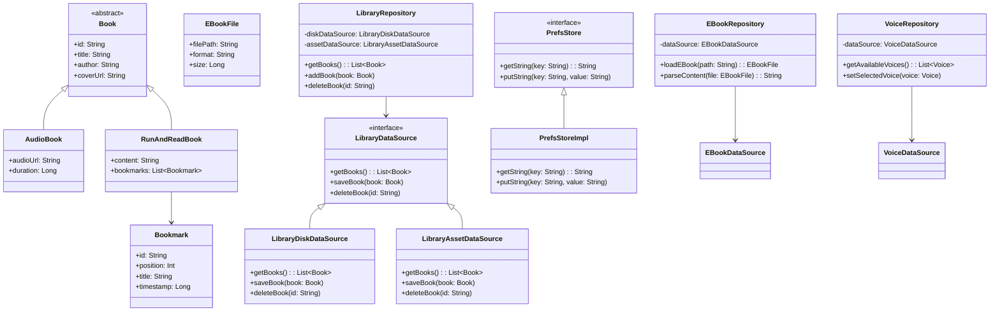

# RunAndRead Architecture Overview

This document provides a high-level overview of the RunAndRead Android application architecture.

## Project Structure

### Package Organization

- **`ui/`**: All UI-related components organized by feature
  - `library/`: Book library screen and components
  - `player/`: Book player screen and controls
  - `settings/`: App and book settings screens
  - `about/`: About screen and app information
  - `navigation/`: Navigation logic and ViewModels
  - `components/`: Reusable UI components

- **`data/`**: Data layer components
  - `model/`: Data models and entities
  - `repository/`: Repository implementations
  - `datasource/`: Data source interfaces and implementations

- **`audio/`**: Audio playback functionality
- **`voice/`**: Text-to-speech functionality
- **`di/`**: Dependency injection modules
- **`services/`**: Background services
- **`app/`**: Application class and global configuration

## Application Architecture

The following diagram shows the overall architecture of the RunAndRead application:

## Application Layers

### 1. UI Layer

The UI layer is built using Jetpack Compose and follows the MVVM (Model-View-ViewModel) pattern:

- **Views**: Compose UI components that render the user interface
  - `LibraryScreenView`: Displays the library of books
  - `PlayerScreenView`: Shows the player interface for reading/listening to books
  - `BookSettingsView`: Provides settings for book playback
  - `AboutScreenView`: Shows information about the app

- **ViewModels**: Manage UI state and business logic
  - `LibraryScreenViewModel`: Manages the library of books
  - `PlayerViewModel`: Controls the playback of books
  - `BookSettingsViewModel`: Handles book settings
  - `VoiceSelectorViewModel`: Manages voice selection for TTS
  - `NavigationViewModel`: Controls navigation between screens

### 2. Player Layer

The player layer is responsible for playing books, either as audio or using text-to-speech:

**Components:**
- `BookPlayer`: Interface defining common player functionality
- `AudioBookPlayer`: Implementation for playing audio books using ExoPlayer
- `SpeechBookPlayer`: Implementation for playing books using text-to-speech

### 3. Text-to-Speech (TTS) Layer

The TTS layer handles the conversion of text to speech:

- `SimpleSpeechProvider`: Provides TTS functionality
- `SpeakingCallBack`: Interface for communication between TTS and UI

### 4. Data Layer

The data layer manages the app's data:

**Components:**
- **Models**:
  - `Book`: Base class for all book types
  - `AudioBook`: Represents an audio book
  - `RunAndReadBook`: Represents a book in the app
  - `Bookmark`: Represents a bookmark in a book
  - `EBookFile`: Represents an e-book file

- **Repositories**:
  - `LibraryRepository`: Manages the library of books
  - `EBookRepository`: Handles e-book file operations
  - `VoiceRepository`: Manages TTS voices

- **Data Sources**:
  - `LibraryDataSource`: Interface for library data operations
  - `LibraryDiskDataSource`: Implementation for disk-based library storage
  - `LibraryAssetDataSource`: Implementation for asset-based library storage
  - `EBookDataSource`: Handles e-book file operations
  - `VoiceDataSource`: Manages TTS voices
  - `PrefsStore`: Interface for preferences storage
  - `PrefsStoreImpl`: Implementation of preferences storage

### 5. Service Layer

The service layer provides background services:

- `PlayerService`: Foreground service for media playback

## Dependency Injection

The app uses Hilt for dependency injection:

- `AppModule`: Provides app-wide dependencies

## Navigation

Navigation is handled using Jetpack Navigation Compose.

### Screen Navigation:
- **SplashScreen**: Initial loading screen
- **LibraryScreen**: Main screen showing the book library
- **PlayerScreen**: Book playback interface with controls
- **BookSettingsScreen**: Configuration for book playback
- **VoiceSelector**: TTS voice selection dialog
- **AboutScreen**: App information and credits

## Data Flow

The following diagram illustrates how data flows through the application:

### Data Flow Steps:
1. User interacts with the UI
2. UI events are sent to ViewModels
3. ViewModels update state and call repositories as needed
4. Repositories interact with data sources
5. Data flows back to ViewModels
6. ViewModels update UI state
7. UI recomposes based on new state

## Threading

The app uses Kotlin Coroutines for asynchronous operations:

- ViewModels use `viewModelScope` for coroutine management
- Repositories use suspend functions for asynchronous operations
- Data sources perform I/O operations on appropriate dispatchers
